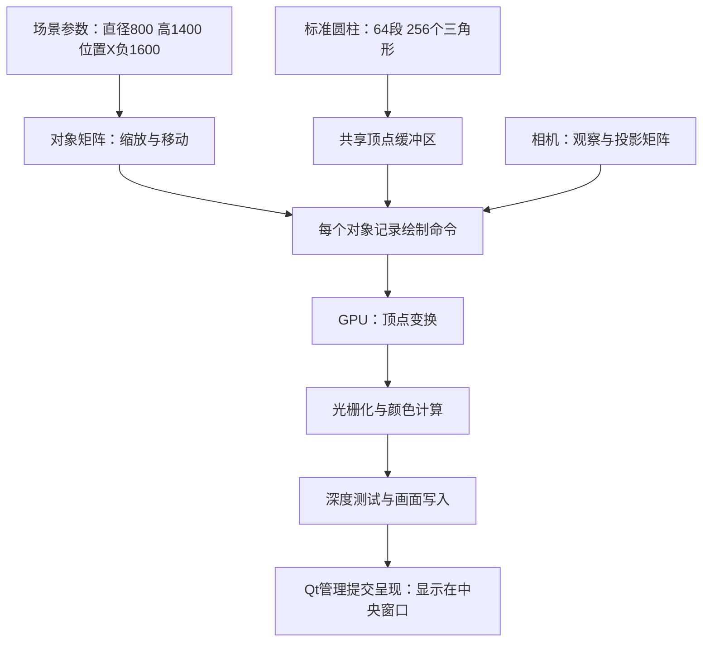

# 从零认识 Nothing3D：Qt 窗口与 Vulkan 圆柱体绘制

这份说明面向刚开始学编程的读者，依据 2026-09-11 的当前工作区代码编写，包括场景编辑、移动手柄、撤销重做和工程文件功能。它描述当前实现，不代表这些工作区改动已经全部提交到 GitHub。

先记住一句话：**C++ 写程序逻辑，Qt 搭窗口并接收操作，Vulkan 把我们准备的三角形交给显卡，最终得到窗口中的三维画面。**

不必第一次就背下所有函数名。先看懂数据怎样一步步变成画面，再对照源码。

## 1. 你眼前的软件由什么组成

打开程序时，可以看到功能区、场景列表、中央三维区域和属性面板。它们分工如下：

| 界面部分 | 做什么 | 主要代码 |
| --- | --- | --- |
| 顶部功能区 | 创建、导航、工程操作等按钮 | [Ribbon.cpp](../src/ui/Ribbon.cpp) |
| 场景列表 | 显示对象名称，选择对象 | [MainWindow.cpp](../src/ui/MainWindow.cpp) |
| 属性面板 | 输入直径、高度、位置和角度 | [MainWindow.cpp](../src/ui/MainWindow.cpp) |
| 中央视图 | 显示模型、网格、轴和移动手柄 | [VulkanViewport.cpp](../src/render/VulkanViewport.cpp) |
| 场景数据 | 记住每个对象是什么、在哪里、多大 | [Scene.h](../src/scene/Scene.h) |

当前已经可以创建长方体和圆柱体、选择和修改属性、拖动三轴移动手柄、复制删除、撤销重做，以及打开和保存 `.n3d` 工程。

软件里的“圆柱体”有两种表示：场景里保存的是“直径 800 mm、高 1400 mm”等参数；画面里显示的是由这些参数决定大小和位置的三角形表面。

## 2. 阅读代码前需要的几个词

| 词语 | 在这里怎么理解 |
| --- | --- |
| C++ | 编写这个桌面程序所用的语言 |
| Qt | 一套用 C++ 使用的工具，提供窗口、按钮、输入框和事件处理等能力 |
| CPU / GPU | CPU 主要执行这里的界面和场景逻辑；GPU 并行执行大量绘图计算 |
| Vulkan | 程序与图形驱动交互的一套接口，可以创建绘图资源、记录命令并安排 GPU 工作 |
| 函数 | 一段有名字、可以反复调用的操作，例如“生成圆柱体顶点” |
| 类 | 将相关数据和操作组织到一起的类型，例如 OrbitCamera 管理相机 |
| 顶点 | 图形的角点，本项目记录它的位置与颜色 |
| 缓冲区 | 存放一批数据的空间，这里主要用来让 GPU 读取顶点 |
| 着色器 | 在 GPU 上执行的小程序，用于计算位置、颜色等 |
| 一帧 | 绘制并显示的一张画面 |

`.h` 通常放类型说明或可直接包含的小函数，`.cpp` 通常放 C++ 实现。`#include` 表示引入其他文件的声明。`std::vector` 可以先理解为长度可变的列表。

后文代码块有些是从源码摘取的关键语句，有些明确标注为简化流程；它们不是可以拼接后独立运行的完整程序。

## 3. Qt 和 Vulkan 怎样接到一起

### 3.1 构建时先准备两类程序

[CMakeLists.txt](../CMakeLists.txt) 是构建说明，告诉工具如何把源码做成可执行程序。

```text
C++ 源码 ──C++ 编译器──→ 编译结果 ──链接 Qt 等依赖──→ Nothing3D.exe
GLSL 着色器 ──glslc──→ SPIR-V 文件 ──Qt 资源系统──→ 嵌入程序
```

GLSL 是编写着色器的语言，SPIR-V 是编译后的中间格式，图形驱动会据此准备 GPU 执行的代码。项目会编译 `box.vert`、`box.frag`、`grid.vert`、`grid.frag`，所以发布时不需要从当前目录临时找 GLSL 源文件。

工程使用 `find_package()` 寻找 Qt 和 Vulkan SDK，并关联 `Qt6::Widgets`、`Qt6::GuiPrivate`、`Vulkan::Headers`。`Vulkan::Headers` 提供接口声明；实际 Vulkan 函数在这里通过 Qt 提供的函数表调用。

### 3.2 程序启动：先建 Qt 应用，再建 Vulkan 实例

正常启动路径位于 [main.cpp](../src/app/main.cpp)。简化顺序如下：

```cpp
QApplication application(argc, argv);
QVulkanInstance instance;
instance.setApiVersion(QVersionNumber(1, 0, 0));
// 实际代码还会开启可用的验证层，并检查初始化是否失败。
instance.create();
MainWindow window(&instance);
window.show();
application.exec();
```

`QApplication` 负责应用的事件循环：等待点击、按键和窗口变化，并把事件交给对应对象。`QVulkanInstance` 建立 Vulkan 运行环境的入口。实例先于窗口构造，窗口销毁后才销毁实例，避免窗口还在使用已经失效的资源。

验证层可以理解为 Vulkan 操作检查工具，用于报告不合法的使用方式。项目在它可用时启用；缺少它不等于缺少绘图能力。

### 3.3 在 Qt 主窗口中放入 Vulkan 窗口

[VulkanViewport.h](../src/render/VulkanViewport.h) 中有：

```cpp
class VulkanViewport final : public QVulkanWindow
```

可以读成：“VulkanViewport 在 Qt 的 Vulkan 窗口基础上增加自己的功能。”它处理相机、选择、模型显示和鼠标操作。

主窗口中的关键连接是：

```cpp
auto* renderWindow = new VulkanViewport;
renderWindow->setVulkanInstance(instance_);
viewport = QWidget::createWindowContainer(renderWindow, workspace);
```

第一句创建窗口，第二句把 Vulkan 实例交给它，第三句把这个窗口包装进 Qt 的普通控件布局。然后它与场景列表、属性面板一起放进 `QSplitter`。`QSplitter` 就是允许拖动分隔线调整区域大小的布局控件。

因此中央区域是一个嵌入式 Vulkan 窗口，而三维画面由项目自己的渲染代码提供。

### 3.4 Qt 在适当时候调用我们的绘图代码

`VulkanViewport::createRenderer()` 返回一个自定义 `SceneRenderer`。它继承 Qt 的 `QVulkanWindowRenderer`，实现下面这些回调函数。“回调”就是 Qt 在适当时机调用我们写的函数。

| 回调 | 做什么 | 发生时机 |
| --- | --- | --- |
| `initResources()` | 准备模型顶点和缓冲区等 | 设备资源初始化时 |
| `initSwapChainResources()` | 创建适用于当前绘图目标的管线 | 交换链创建或重建时 |
| `startNextFrame()` | 记录本帧绘图命令 | 需要新画面时 |
| `releaseSwapChainResources()` | 释放相关管线等 | 交换链释放时 |
| `releaseResources()` | 释放顶点缓冲区等 | 设备资源释放时 |

“交换链”是一组轮流用于绘制和显示的图像；窗口改变大小时可能需要重建。“管线”是处理顶点、三角形、颜色和深度的一套绘图规则。

Qt 管理窗口、设备、交换链和基础提交呈现流程。项目负责上传几何、创建管线和记录绘制命令；另有 [QtPresentSync.cpp](../src/render/QtPresentSync.cpp) 适配呈现同步，因此目前锁定 Qt 6.10.3，不能随意替换 Qt 版本。

### 3.5 C++ 怎样真正调用 Vulkan

在 [ColorMesh.cpp](../src/render/ColorMesh.cpp) 中：

```cpp
functions_ = window->vulkanInstance()->deviceFunctions(window->device());
```

它取得当前设备的 Vulkan 函数表。随后可以调用：

```cpp
functions_->vkCreateBuffer(...);
functions_->vkCmdBindPipeline(...);
functions_->vkCmdDraw(...);
```

这里的省略号表示真实代码中的参数。`vkCreateBuffer` 创建缓冲区；`vkCmd...` 系列把命令记录到命令缓冲区。调用 `vkCmdDraw` 并不意味着此刻屏幕已经更新，命令还要被提交并由 GPU 执行。

## 4. 追踪初始场景中的一个圆柱体

### 4.1 起点只是一份参数

[SceneExamples.h](../src/scene/SceneExamples.h) 创建初始对象：

```cpp
scene.add({"圆柱体 1", CylinderParameters{}, {-1600, 0, 0}});
```

这里 `CylinderParameters{}` 使用 [Scene.h](../src/scene/Scene.h) 中的默认值：直径 800 mm，高度 1400 mm。位置 `(-1600,0,0)` 表示底面中心在世界原点的 X 负方向 1600 mm 处。

这些参数仍然在 CPU 的场景数据中。Vulkan 没有“按直径创建圆柱体”的现成绘制命令，我们需要自己把它转成三角形。

### 4.2 为什么用三角形

三个不共线的点就能确定一个平面三角形。GPU 擅长判断三角形覆盖哪些屏幕位置，再计算它们的颜色。

圆柱体的曲面可以用很多窄矩形近似，每个矩形切成两个三角形；上、下圆面则像切蛋糕一样切成许多三角形。段数越多，圆周越接近圆，数据量也越大。

### 4.3 64 段圆周如何计算

[CylinderGeometry.h](../src/render/CylinderGeometry.h) 的 `cylinderVertices()` 把圆周分成 64 段，每段角度为 `360° / 64 = 5.625°`。

项目采用 Y 向上，因此圆周位于 XZ 平面。圆上的点可以写成：

```text
x = 半径 × cos(角度)
z = 半径 × sin(角度)
y = 0 或高度
```

不熟悉三角函数也没关系：可以先把 sin、cos 理解为“输入转了多少角度，得到圆周点坐标”的工具。C++ 三角函数使用弧度，一整圈约为 6.283185307。

当前真正用于共享模型资源的调用是 `cylinderVertices(1, 1)`：先生成直径 1 米、高 1 米的标准圆柱。函数声明里 0.8、1.4 的默认值不控制这条渲染路径。

标准圆柱半径为 0.5；在角度 0 时，底边点是 `(0.5,0,0)`，顶边点是 `(0.5,1,0)`。每次增加 5.625°，就找到下一对点。

### 4.4 一段生成四个三角形

对于相邻的两个角度 a、b，代码创建四个侧面角点：

```text
r（a角，顶部）────s（b角，顶部）
│              / │
│            /   │
│          /     │
p（a角，底部）────q（b角，底部）
```

这个展开示意图表示一块窄侧面。实际四点分布在三维空间里。对角线 p—s 把它切成两个三角形：

```cpp
triangle(p, r, s);
triangle(p, s, q);
```

再添加顶面中心与两个顶边点组成的三角形，以及底面中心与两个底边点组成的三角形。

| 每段内容 | 三角形数量 |
| --- | ---: |
| 侧面矩形 | 2 |
| 顶面扇形 | 1 |
| 底面扇形 | 1 |
| 合计 | 4 |

所以整个圆柱是 **64 × 4 = 256 个三角形**，每个三角形记录三个顶点，得到 **768 条顶点记录**。

当前使用普通三角形列表，没有用索引缓冲区复用相同角点，因此 768 是记录数，不是 768 个互不相同的空间位置。封闭的是外表面，也没有在圆柱内部填充大量三角形。

### 4.5 顶点还带颜色

顶点结构位于 [BoxGeometry.h](../src/render/BoxGeometry.h)：

```cpp
struct BoxVertex {
    float position[3];
    float color[3];
};
```

`position` 是 X、Y、Z；`color` 是红、绿、蓝三个分量，通常取 0～1。尽管名字叫 BoxVertex，这个结构同样用于圆柱体。

圆柱侧面根据角度预先赋予深浅不同的青色，顶面较亮、底面较暗。当前没有真实灯光、法线计算、材质纹理或投影阴影；这些明暗是生成顶点时设置的示意颜色。

## 5. 从 C++ 顶点列表到 GPU 可读取的数据

[SceneGeometry::vertices()](../src/render/SceneGeometry.h) 将单位长方体和单位圆柱体放入同一个列表：

```text
前 36 条记录：长方体
接着 768 条记录：圆柱体
```

在渲染器初始化时，这个列表交给 `ColorMesh::initialize()`。它依次执行：

1. `vkCreateBuffer`：创建保存顶点的缓冲区对象。
2. 查询内存要求，找到 CPU 可访问且满足一致性要求的内存类型。
3. `vkAllocateMemory`：分配内存。
4. `vkBindBufferMemory`：让缓冲区使用这块内存。
5. `vkMapMemory` 与 `memcpy`：取得 CPU 可写地址，复制顶点列表。
6. `vkUnmapMemory`：结束映射。

这里没有额外的暂存缓冲区复制流程。选用的内存让 CPU 可以写入、GPU 可以读取；它是否位于独立显存或共享内存，取决于设备的内存类型。

多个圆柱体共享这份标准几何数据，每个对象绘制时传入不同的尺寸和位置变换。修改圆柱直径，不需要重新生成和上传这 768 条记录。

## 6. 标准圆柱怎样变成 800 mm × 1400 mm

“矩阵”在这里可以先理解为一张变换规则表：输入一个点的位置，得到缩放、旋转或移动后的新位置。

[SceneGeometry::prepare()](../src/render/SceneGeometry.h) 把业务毫米换成渲染米，并为初始圆柱建立规则：

```text
X、Z 方向缩放为 0.8 倍；Y 方向缩放为 1.4 倍。
没有对象旋转。
沿 X 方向平移 -1.6 米。
```

例子：标准圆柱顶边上的点 `(0.5,1,0)`，缩放后为 `(0.4,1.4,0)`，再平移后为 `(-1.2,1.4,0)`。

这就得到直径 0.8 米、高 1.4 米、底面中心在 `(-1.6,0,0)` 的圆柱体。一般对象按局部缩放、X/Y/Z 旋转、世界平移的顺序变换。

## 7. 三维坐标怎样变成屏幕图形

### 7.1 相机决定从哪里看

[OrbitCamera.h](../src/render/OrbitCamera.h) 保存观察中心、观察距离、水平角和俯仰角。它生成两类规则：

- 观察矩阵 V：相机在哪里、朝哪里看。
- 投影矩阵 P：将相机看到的三维内容映射到二维画面，形成近大远小的透视效果。

对象矩阵 M 决定模型大小和位置。再加上 Vulkan 坐标修正 C，基本关系是 `C × P × V × M × 顶点`。实际代码还在对象矩阵前加入可选的整场景预览旋转。

暂时不必手算矩阵，只需理解：先摆好模型，再从相机位置观察，最后投影到画面。

### 7.2 管线告诉 GPU 怎样读顶点

`ColorMesh::createPipeline()` 指定：位置是三个浮点数，颜色也是三个浮点数；每三个顶点组成一个三角形；三角形内部填色；模型开启深度测试与深度写入。

它还指定使用 [box.vert](../shaders/box.vert) 和 [box.frag](../shaders/box.frag)。文件名虽然含 box，圆柱体也使用这两个通用颜色着色器。

### 7.3 顶点着色器：计算角点最终位置

```glsl
gl_Position = transform.mvp * vec4(position, 1.0);
```

`position` 是输入的局部顶点，`mvp` 是 C++ 准备好的组合矩阵，输出 `gl_Position` 是裁剪空间坐标，还不是屏幕像素坐标。之后 GPU 会裁剪不可见区域、进行透视除法，再映射到视窗。

同一个顶点着色器还根据是否选中，将原颜色与金色混合，形成选择高亮。

### 7.4 光栅化与片元着色器：填充三角形

“光栅化”负责找出三角形覆盖的屏幕采样位置，生成待处理的片元。可以把片元先理解为可能写入画面的颜色候选，最终还要通过深度等检查。

GPU 在三角形内部插值顶点颜色，然后执行片元着色器：

```glsl
fragmentColor = vec4(vertexColor, 1.0);
```

这里直接输出颜色，最后的 1.0 表示不透明。对本项目一个侧面三角形而言，三个顶点颜色相同，因此该三角形内部颜色一致。

### 7.5 深度解决前后遮挡

除了颜色图像，还有深度图像记录距离信息。当前使用 `VK_COMPARE_OP_LESS`：更靠近相机的片元可以替换较远的片元。这样圆柱前面的表面能挡住后面的表面，也能与长方体形成正确遮挡。

当前圆柱管线没有开启背面剔除；不能把“看不见后面的表面”全部归因于背面剔除，深度测试在这里发挥主要作用。

## 8. 最后一次绘制调用如何读

圆柱体对应的绘制命令，展开为容易阅读的形式是：

```cpp
vkCmdDraw(command, 768, 1, 36, 0);
```

这是对 `ColorMesh::draw()` 最终调用参数的解释，真实代码通过 `functions_` 函数表调用。

| 参数 | 含义 |
| --- | --- |
| command | 把命令记到哪里 |
| 768 | 读取多少条顶点记录 |
| 1 | 此次绘制的实例数量 |
| 36 | 从第 36 个顶点索引开始，跳过前面的长方体记录 |
| 0 | 起始实例编号 |

绘制前还需要绑定管线与顶点缓冲区，并通过 push constants 传入矩阵和高亮颜色等少量参数。多个圆柱体当前逐对象调用绘制，共享几何，但没有合成一次多实例绘制。

`SceneRenderer::startNextFrame()` 在本帧画完模型、网格、轴、预览和移动手柄、方向方块后，结束渲染过程并调用 `frameReady()`，交回 Qt 进行后续提交和呈现管理。

当前会先画选中对象，再画其他对象，以便原位复制产生完全重叠的对象时，选中副本仍保留高亮。



## 9. 你改一次高度，程序里发生了什么

例如选中圆柱体，把高度从 1400 改为 2000，然后按回车：

1. Qt 输入框发出数值变化信号。信号就是通知，`connect()` 指定收到通知后执行什么函数。
2. `MainWindow::commitDimension()` 取得新高度。
3. `applyObjectEdit()` 更新场景数据，校验参数，通知视口，并记录撤销历史。
4. `VulkanViewport::updateObject()` 更新视口使用的数据并请求重绘。
5. 新帧中 `SceneGeometry::prepare()` 将 Y 缩放系数从 1.4 改为 2.0。
6. GPU 使用同一份单位圆柱顶点，配合新的矩阵，得到更高的圆柱。

保存工程主要是保存对象参数等场景信息；重新打开后，程序根据这些数据再次绘制模型。相关文件逻辑见 [ProjectFiles.cpp](../src/ui/ProjectFiles.cpp) 与 [工程文件说明](Q6-files-learning.md)。

## 10. 无限网格、坐标轴与圆柱体的关系

圆柱体是三角形几何。地面无限网格使用另一套着色器：先画覆盖窗口的三角形，再逐像素计算观察射线与 `Y=0` 地面的交点，用交点位置判断是否应画网格线。

X 轴是地面 `Z=0` 的红线，Z 轴是地面 `X=0` 的蓝线；Y 轴是单独裁剪到可见范围的绿色直线。它们和圆柱体使用相同的相机规则，因此转动视角时位置关系仍然一致。

网格没有固定方形边界，但受裁剪与淡出限制。“无限”不代表程序真的存储无限条线。吸附位置由独立逻辑计算，修改网格显示不自动修改吸附步长。

右上角方向方块是一个小视图，只跟随主相机朝向，忽略平移和距离。更详细的数学推导见 [视口学习说明](Viewport-learning.md)；那份文档标注的是 2026-09-09 的版本，本文增加了当前版本功能背景。

## 11. 初学者建议怎样学

先双击 `scripts/run.bat` 运行当前已构建的程序。修改 C++ 或着色器后，执行 `scripts/build.bat` 重新构建，再运行程序查看效果。`scripts/test.bat` 会构建并运行自动测试，`scripts/test-gpu.ps1` 则需要真实桌面与显卡。

建议分四次阅读，每次只解决一个问题：

| 次序 | 问题 | 阅读范围 |
| --- | --- | --- |
| 第一次 | 谁记住了圆柱体的直径？ | Scene.h、SceneExamples.h |
| 第二次 | 圆柱体为什么有 256 个三角形？ | CylinderGeometry.h |
| 第三次 | Qt 怎样调用我们的绘图代码？ | main.cpp、MainWindow::buildWorkspace、createRenderer |
| 第四次 | 三角形怎样被画出来？ | ColorMesh、两个 box 着色器、startNextFrame |

三个可在界面完成的练习：

1. 把圆柱高度从 1400 改为 2000，观察底面中心保持原位；对应 Y 缩放变化。
2. 把圆柱位置 X 增加 1000 mm，观察沿世界 X 轴移动 1 米；对应平移变化。
3. 中键拖动视角，观察模型参数不变；对应相机变化，而不是修改模型。

想练习源码时，可以先修改圆柱顶面颜色并重新构建。注意顶面中心和两个边点都有颜色参数，统一修改才能得到一致颜色。

暂时不要只把 `segments=64` 改成其他值：当前 `SceneGeometry::cylinderCount`、测试以及部分检查代码还按 64 段计算，改变段数需要同步核对这些依赖。这也说明编程中“修改一个数字”有时会影响其他文件的约定。

## 12. 常见疑问

**为什么没找到 drawCylinder？** Vulkan 接收的是顶点和绘制规则。项目先生成圆柱三角形，再使用通用 `vkCmdDraw`。

**为什么圆柱体用了 box.vert？** 文件名来自早期长方体实现，当前内容已经作为通用的“位置变换 + 顶点颜色”着色器使用。

**圆柱体看起来有光，是不是已经有灯光？** 当前是预设的侧面明暗与顶底颜色。真实灯光还需要表面方向、光源等额外计算。

**为什么改尺寸很快？** 标准几何共享，变化主要体现在对象矩阵中；每帧不需要重新上传所有顶点。

**为什么程序不会一直绘制？** 静止视图按需更新；操作和窗口变化请求新帧，预览旋转时由定时器持续请求更新。

**现在的圆柱能作为精确工程曲面吗？** 场景参数可以表达直径和高度，但当前显示表面是固定 64 段的三角形近似，不能将它等同于完整的精确 CAD 曲面建模系统。
