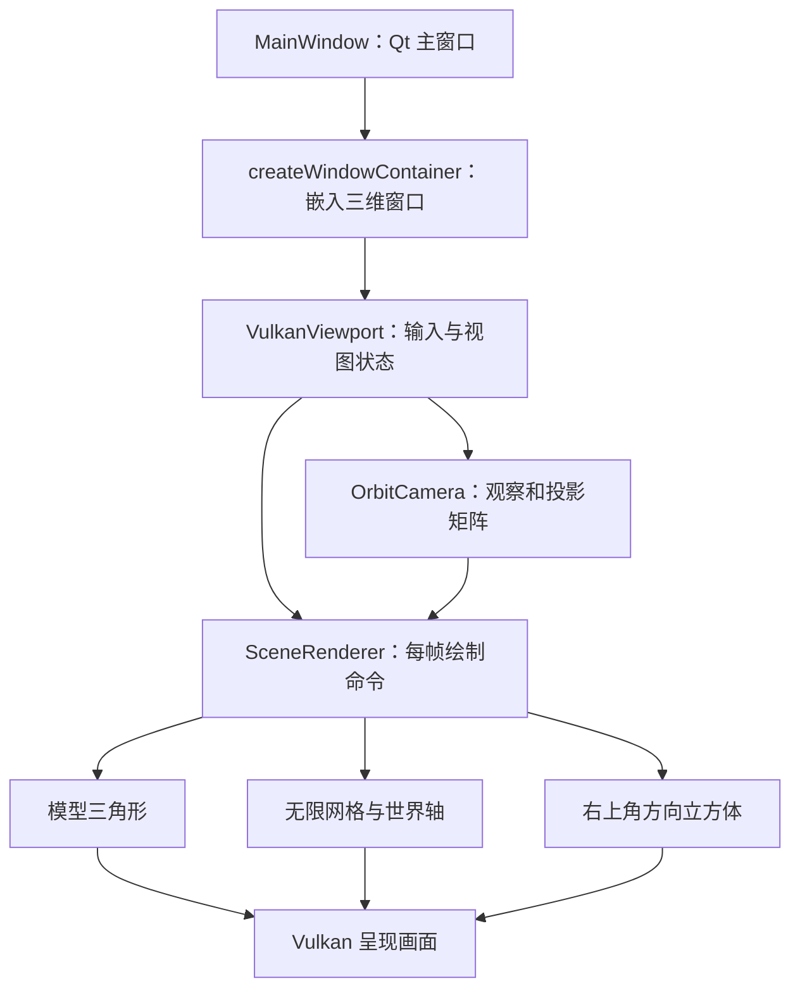

# Qt 中央三维视图、无限网格、XYZ 坐标轴与相机学习说明

本文对应 2026-09-09 的 Nothing3D 实现。阅读目标是理解从 Qt 窗口到 GPU 像素的完整过程，并找到可以动手修改的代码位置。

## 1. 整体分工

Qt 负责主窗口、布局、鼠标键盘事件，以及 Vulkan 窗口、设备和交换链的基础管理。项目自己的 C++ 代码负责场景、几何、相机、绘制命令；GLSL 着色器负责顶点变换与像素颜色。



中央区域不是一个现成的 Qt 建模控件。它是自定义的 `VulkanViewport : QVulkanWindow`，再由 `QWidget::createWindowContainer()` 包装进横向 `QSplitter`，位于场景列表与属性面板之间。

入口：[MainWindow::buildWorkspace](../src/ui/MainWindow.cpp)、[VulkanViewport](../src/render/VulkanViewport.h)。

## 2. 一帧画面如何产生

[SceneRenderer](../src/render/VulkanViewport.cpp) 实现 `QVulkanWindowRenderer` 的生命周期接口：

| 函数 | 主要工作 |
| --- | --- |
| `initResources()` | 上传基本体、全屏三角形、Y 轴和方向立方体等顶点 |
| `initSwapChainResources()` | 创建绘制管线，初始化呈现同步适配 |
| `startNextFrame()` | 清屏、记录绘制命令、通知 Qt 当前帧准备完成 |
| `releaseSwapChainResources()` | 释放随交换链重建的资源 |
| `releaseResources()` | 释放设备相关资源 |

实际绘制顺序为：清除颜色和深度 → 场景模型 → 地面网格及 X/Z 轴 → Y 轴 → 创建时的线框预览 → 右上角方向立方体 → `frameReady()`。

模型先写入深度；网格和世界轴参与深度测试但不写深度，因此它们能被前面的模型遮挡。方向立方体绘制前只清除右上角区域的深度，保证它不被场景遮挡，同时保留自身各面的前后关系。

静止时不会在 `startNextFrame()` 中无限请求下一帧。导航、编辑等操作调用 `requestUpdate()`，窗口暴露或调整大小也会触发绘制。开启预览旋转时，定时器更新角度并请求重绘。

Qt 承担基础呈现管理，但本项目还有 [QtPresentSync](../src/render/QtPresentSync.cpp) 适配：按交换链图像选择呈现信号量。它依赖 Qt 私有接口，因此当前工程锁定 Qt 6.10.3。

## 3. 世界坐标与模型变换

当前约定是 **Y 向上，XZ 平面为地面，X 红、Y 绿、Z 蓝**。业务数据使用毫米；[SceneGeometry::prepare](../src/render/SceneGeometry.h) 将尺寸和位置除以 1000，转换为渲染使用的米。

模型使用共享的单位长方体、单位圆柱体顶点，每个对象通过自己的模型矩阵改变尺寸、方向与位置。按列向量计算：

```text
裁剪坐标 = C × P × V × Rpreview × Mobject × 局部顶点
```

| 符号 | 含义 |
| --- | --- |
| `Mobject` | 对象的缩放、旋转和平移 |
| `Rpreview` | 空格开启的整个场景预览旋转 |
| `V` | 相机观察矩阵 |
| `P` | 透视投影矩阵 |
| `C` | Qt 提供的 Vulkan 裁剪坐标修正矩阵 |

乘法从右往左作用于顶点。`C` 负责适配 Vulkan 的坐标约定，包括深度范围。透视除法后，再映射到视窗像素。

网格和世界轴定义在世界坐标中，使用 `VP = C × P × V`，不包含模型与预览旋转。因而模型旋转时，地面参考系保持固定。

## 4. 无限网格：逐像素求地面交点

无限网格没有存储无限多条线，也没有一块不断扩大的地面网格。渲染器只提交三个顶点 `(-1,-1)`、`(3,-1)`、`(-1,3)`，形成覆盖整个视窗的三角形。

[ColorMesh::drawGrid](../src/render/ColorMesh.cpp) 将 `VP` 和它的逆矩阵通过 128 字节 push constants 传给着色器。

### 4.1 从屏幕反推世界射线

[grid.vert](../shaders/grid.vert) 将屏幕坐标分别放到 Vulkan 深度 0 和 1 上，再乘逆矩阵并除以 w，得到世界空间的 `nearPoint` 和 `farPoint`。光栅化后，片元着色器获得每个像素对应的两点。

两点定义射线上的位置：

```text
p(t) = nearPoint + t × (farPoint - nearPoint)
```

地面要求 `p.y = 0`，所以 [grid.frag](../shaders/grid.frag) 求解：

```glsl
float dy = farPoint.y - nearPoint.y;
float t = -nearPoint.y / dy;
vec3 p = mix(nearPoint, farPoint, t);
```

接近平行地面的射线、交点不在近远平面之间的情况会被丢弃，避免无效除法和画出不可见的地面。

### 4.2 判断交点是否位于网格线

用 `p.xz / spacing` 将坐标转换为“多少格”，`fract()` 提取周期位置，计算到最近整数网格线的距离。

当前叠加三档间距：

| 间距 | 意义 | 基础透明度权重 |
| --- | --- | --- |
| 0.1 m | 100 mm 细格 | 0.30 |
| 1 m | 主格 | 0.55 |
| 10 m | 大尺度参考格 | 0.70 |

`fwidth()` 估计相邻像素间的坐标变化，用它把世界距离换算成近似像素距离，控制抗锯齿线宽；屏幕上过密的层级通过 `smoothstep()` 淡出。这是三档网格同时计算后混合，并不是 CPU 根据缩放重新生成线段。

此外，距离按 `length(p - nearPoint)` 在 35～95 的区间逐渐淡出。这里使用的是到近裁剪面点的距离，不是严格的到相机眼睛的距离。

### 4.3 为什么模型能挡住网格

全屏三角形只是触发像素计算。网格交点会重新投影，并写入真实的地面深度：

```glsl
vec4 clip = camera.vp * vec4(p, 1);
gl_FragDepth = clip.z / clip.w;
```

随后通过深度测试和透明混合形成最终像素。否则只使用全屏三角形自己的深度，就不能表达地面与模型的正确遮挡关系。

“无限”表示没有固定的世界空间方形边界。当前相机远裁剪面是 100，网格还有距离与密度淡出，因此可见范围依然有限；极远坐标也受浮点精度约束。

旧的有限网格函数 `Guides::ground()` 和它的测试已删除。当前网格绘制入口为 `drawGrid()`；渲染器中的 `ground_` 名称指向全屏网格资源，不是旧函数。

## 5. XYZ 世界坐标轴

X、Z 轴直接在地面片元着色器中计算：X 轴满足 `Z = 0`，Z 轴满足 `X = 0`。同样使用 `fwidth()` 估计像素宽度，并分别混入红色和蓝色。它们继承地面着色器的距离淡出。

`gridMode` 是创建管线时指定的着色器特化常量：0 为网格和地面轴都显示，1 为仅网格，2 为仅地面轴。三套管线允许界面独立开关网格与坐标轴。

Y 轴垂直地面，单独使用绿色线段绘制。[infiniteYAxis](../src/render/InfiniteAxis.h) 的方法是：

1. 将世界直线 `(0,t,0)` 变换到齐次裁剪空间。
2. 用六个可见范围约束 `-w ≤ x ≤ w`、`-w ≤ y ≤ w`、`0 ≤ z ≤ w`，求参数 t 的有效区间。
3. 将两个端点进行透视除法，得到归一化设备坐标。
4. 构造矩阵，把原有单位线段 `(0,0,0) → (0,1,0)` 映射到这两个端点。

这样画的是当前可见的一段无限直线，不需要给轴硬编码几万米的长度。轴完全在视窗外、退化成点等情况不绘制。当前 Y 轴没有像地面 X/Z 轴那样的距离淡出。

## 6. 轨道相机

[OrbitCamera](../src/render/OrbitCamera.h) 是项目自写的数学与控制类。它用 Qt 的向量和矩阵类型，不需要在场景中放一个可见的相机模型。

| 参数 | 初始值 | 含义 |
| --- | --- | --- |
| `target` | `(0, 0.75, 0)` | 观察中心，渲染单位为米 |
| `distance` | 5.5 | 到观察中心的距离 |
| `yaw` | 35° | 水平角度 |
| `pitch` | 25° | 俯仰角度 |

角度转换成弧度后，计算从观察中心指向相机的方向：

```text
direction = (sin(yaw)cos(pitch), sin(pitch), cos(yaw)cos(pitch))
eye = target + direction × distance
V = lookAt(eye, target, 世界向上方向)
```

这里 `direction()` 指向相机，实际朝前看的方向是它的负值。

透视矩阵由 `perspective(45°, aspect, 0.1, 100)` 生成，其中 aspect 来自当前交换链图像的宽高比。窗口变宽或变高后，重新计算宽高比可以避免模型被拉伸。

### 6.1 旋转、缩放与平移

旋转：每个鼠标像素改变 0.4°；水平角取余，俯仰限制为 -85°～85°。限制俯仰可以避免观察方向与世界向上方向平行，引起相机基向量退化。

缩放：`distance *= pow(0.85, steps)`，并限制为 2.5～30。视野角不变，因此这里是相机靠近或远离观察中心。它也不是以鼠标指向的位置为中心缩放。

平移：先用叉积计算相机的 right、up 方向，再移动观察中心：

```text
scale = 2 × distance × tan(45° / 2) / 视口高度
target += (-right × dx + up × dy) × scale
```

scale 近似表达观察中心深度处每个屏幕像素对应的世界长度，让远近不同的视角都能自然拖动。

### 6.2 输入路径

| 输入 | 当前行为 |
| --- | --- |
| 中键拖动 | 轨道旋转 |
| Shift + 中键拖动 | 平移 |
| 滚轮 | 缩放 |
| 左键拖动 | 按工具栏选择的旋转、平移、缩放模式导航 |
| 左键单击 | 选择对象；创建期间确认地面放置 |
| F / 右上角 Home | 恢复默认视图，并停止预览旋转 |
| 空格 | 开关场景预览旋转；放置期间禁用 |

左键按下后先记录位置，超过 Qt 的拖动阈值才进入导航，避免单击选择时轻微移动导致视角旋转。相机参数变更后调用 `requestUpdate()`。

## 7. 为什么网格与模型始终对齐

相机移动时，模型、网格和世界轴都使用同一组 `C × P × V`。模型从世界投影到屏幕，网格则先从屏幕反推世界交点，再投影回深度；两条路径使用相同变换，所以坐标一致。

相机旋转与模型旋转需要区分：相机旋转修改 yaw/pitch，所有世界内容的屏幕位置一起变化；空格预览修改 `modelAngle`，只影响场景模型的变换，网格保持世界参考方向。多个对象会随整个场景预览绕世界原点旋转，并非分别绕自身中心自转。

## 8. 右上角方向立方体

方向立方体是同一 Vulkan 渲染过程中的小视图，使用独立 viewport/scissor 区域。`compassRect()` 将其放在右上角并处理像素比例。

`compassMatrix()` 保留主相机观察矩阵的旋转部分，将平移替换为固定值，然后使用正交投影。因此它跟随相机朝向，忽略平移和距离，屏幕尺寸稳定。

[ViewCubeGeometry](../src/render/ViewCubeGeometry.h) 创建六个面、边框、方位环与文字几何。面文字先由 QPainter 在内存图像中栅格化，再转换为静态彩色小四边形上传 GPU；不是每帧用 Qt 在窗口上绘制文字。

当前只有 Home 按钮可重置视图，点击六个面尚未实现定向观察。`GuideGeometry.h` 中旧的 `compass()`、`letters()` 仍被测试引用，实际方向立方体使用的是 `ViewCube` 中的几何；这两者也不要与已删除的有限网格混淆。

## 9. 阅读顺序与练习

建议依次阅读：

1. [MainWindow.cpp](../src/ui/MainWindow.cpp)：找 `buildWorkspace()`，理解嵌入关系。
2. [OrbitCamera.h](../src/render/OrbitCamera.h)：先理解四个参数与两个矩阵。
3. [VulkanViewport.cpp](../src/render/VulkanViewport.cpp)：看 `startNextFrame()`、`modelViewProjection()` 和鼠标事件。
4. [ColorMesh.cpp](../src/render/ColorMesh.cpp)：看 `createPipeline()`、`draw()`、`drawGrid()`。
5. [grid.vert](../shaders/grid.vert) 与 [grid.frag](../shaders/grid.frag)：跟踪屏幕 → 世界地面 → 深度的过程。
6. [InfiniteAxis.h](../src/render/InfiniteAxis.h)、[GuideGeometry.h](../src/render/GuideGeometry.h) 与 [ViewCubeGeometry.h](../src/render/ViewCubeGeometry.h)：区分世界轴与方向覆盖视图。

可做三个独立小练习，每次修改后重新构建：将细网格间距从 0.1 改为 0.2，观察格数；修改初始 yaw/pitch，观察世界原点不变而视角变化；平移和缩放主视图，确认右上角方块位置与大小不变。

如果调整相机视野角，需要同步考虑 `pan()` 中使用的 45°，否则拖动比例与实际投影不再匹配。改动默认相机或约束后，也应同步核对测试中的预期值。

网格绘制只提供视觉参考。创建时的 Ctrl 100 mm 吸附由 [GroundPlacement.h](../src/render/GroundPlacement.h) 单独计算；仅改变着色器的网格间距不会自动修改吸附步长。

## 10. 验证方式

运行 `scripts/test.bat` 构建并执行自动测试；`camera_math` 覆盖相机方向、观察目标、角度与距离限制、投影裁剪、方向覆盖视图及无限 Y 轴。它不执行 GPU 网格着色器。

运行 `scripts/test-gpu.ps1 -Rounds 1` 在真实桌面上分别执行集显与独显回归，检查呈现、辅助线和场景功能。构建输出、截图和 GPU 日志保存在被 Git 忽略的 `build/` 中。此次提交的验证结果见 [版本验证记录](Viewport-validation.md)。
